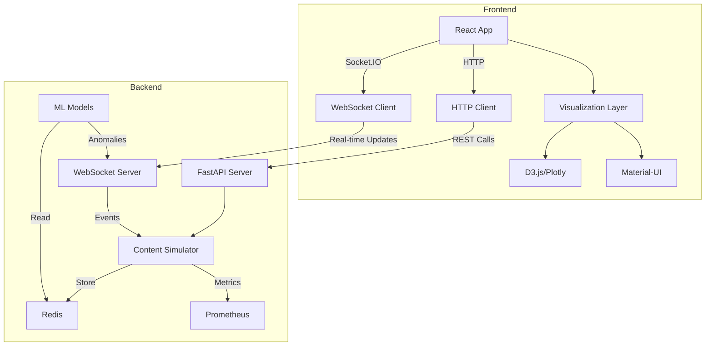
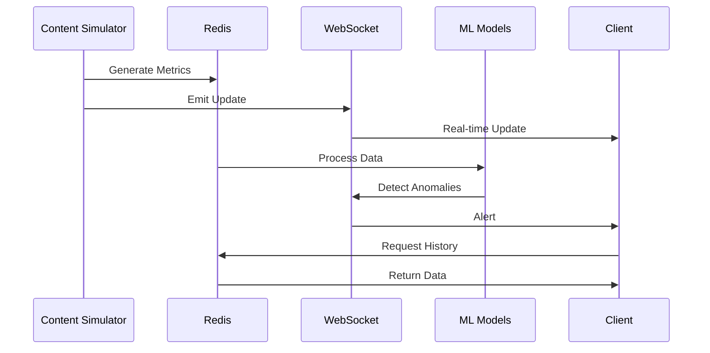

# Real-Time Streaming Performance Monitor

A real-time streaming performance monitoring dashboard that tracks and visualizes key metrics for video, audio, and live streaming content. The system provides comprehensive monitoring of streaming performance, content distribution, and user engagement metrics, with machine learning capabilities for anomaly detection.

## System Architecture

### High-Level Architecture


### Data Flow


## Features

### Streaming Content Monitoring
- Video streams (480p to 4K)
- Audio streams (96kbps to 320kbps)
- Live events streaming
- CDN distribution tracking
- Bandwidth usage analytics

### Real-time Metrics
- Latency and buffering rates
- Viewer counts and engagement
- Content-specific metrics (bitrate, resolution, segment size)
- Geographic distribution via CDN regions
- Bandwidth consumption patterns

### Advanced Analytics
- Machine learning-based anomaly detection
- Predictive performance analytics
- Real-time visualization dashboard
- Historical metrics analysis
- Alert system for performance issues

## Tech Stack

### Backend
- **Framework**: FastAPI
- **Real-time Communication**: Socket.IO
- **Data Storage**: Redis
- **Metrics**: Prometheus
- **Machine Learning**: Scikit-learn, NumPy, Pandas
- **API Documentation**: OpenAPI/Swagger

### Frontend
- **Framework**: React.js
- **State Management**: Redux
- **Visualization**: D3.js/Plotly
- **Real-time Updates**: Socket.IO client
- **UI Components**: Material-UI

## Prerequisites

- Python 3.12+
- Redis Server 5.0+
- Node.js 14+
- npm or yarn

## Installation

1. Clone the repository:
```bash
git clone [repository-url]
cd streaming-monitor
```

2. Set up Python virtual environment:
```bash
python -m venv venv
source venv/bin/activate  # On Windows: .\venv\Scripts\activate
pip install -r requirements.txt
```

3. Start Redis server:
```bash
redis-server
```

4. Start the backend server:
```bash
cd src
python -m uvicorn backend.app:app --reload
```

5. Install frontend dependencies and start the development server:
```bash
cd frontend
npm install
npm start
```

## Components

### Backend Components
- **FastAPI Server**: Handles HTTP endpoints and WebSocket connections
- **Content Simulator**: Generates realistic streaming content metrics
- **Redis Storage**: Real-time metrics storage and retrieval
- **ML Pipeline**: Anomaly detection and predictive analytics
- **Metrics Collector**: Prometheus integration for system metrics

### Data Flow
1. Content simulator generates streaming metrics
2. Metrics are processed and stored in Redis
3. Real-time updates sent via WebSocket
4. ML models process metrics for anomaly detection
5. Frontend visualizes data and alerts

## API Endpoints

### HTTP Endpoints
- `GET /`: Health check endpoint
- `GET /metrics`: Current and historical metrics
- `GET /content`: Active streaming content information
- `GET /analytics`: ML-based analytics and predictions

### WebSocket Events
- `metrics_update`: Real-time metrics updates
- `content_change`: Streaming content status changes
- `anomaly_alert`: ML-detected anomalies

## Simulated Content Types

### Video Content
- Nature documentaries
- Tech talks
- Cooking shows
- Educational content
- Entertainment series

### Audio Content
- Music streams
- Podcasts
- Audiobooks
- Radio broadcasts
- Live commentary

### Live Events
- Sports events
- News coverage
- Concerts
- Gaming tournaments
- Conferences

## Development

### Backend Development
- Main application: `src/backend/app.py`
- Content simulation: `src/backend/content_simulator.py`
- ML models: `src/ml_models/`
- Metrics collection: `src/backend/metrics/`

### Frontend Development
- React components: `src/frontend/src/components/`
- State management: Redux store and actions
- Real-time updates: Socket.IO client integration
- Visualizations: D3.js/Plotly components

## Configuration

### Environment Variables
- `REDIS_HOST`: Redis server host (default: localhost)
- `REDIS_PORT`: Redis server port (default: 6379)
- `API_PORT`: Backend API port (default: 8000)
- `FRONTEND_PORT`: Frontend development server port (default: 3000)

### Redis Configuration
- Metrics retention: 1000 latest metrics
- Data format: JSON serialized metrics
- Key structure: 'metrics_history' for time-series data

## Contributing

1. Fork the repository
2. Create your feature branch
3. Commit your changes
4. Push to the branch
5. Create a new Pull Request

## License

MIT
